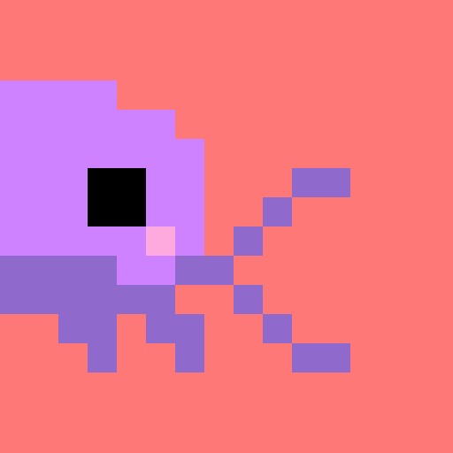
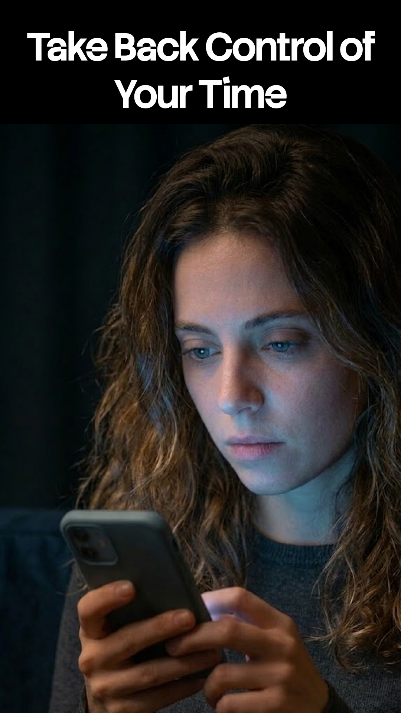
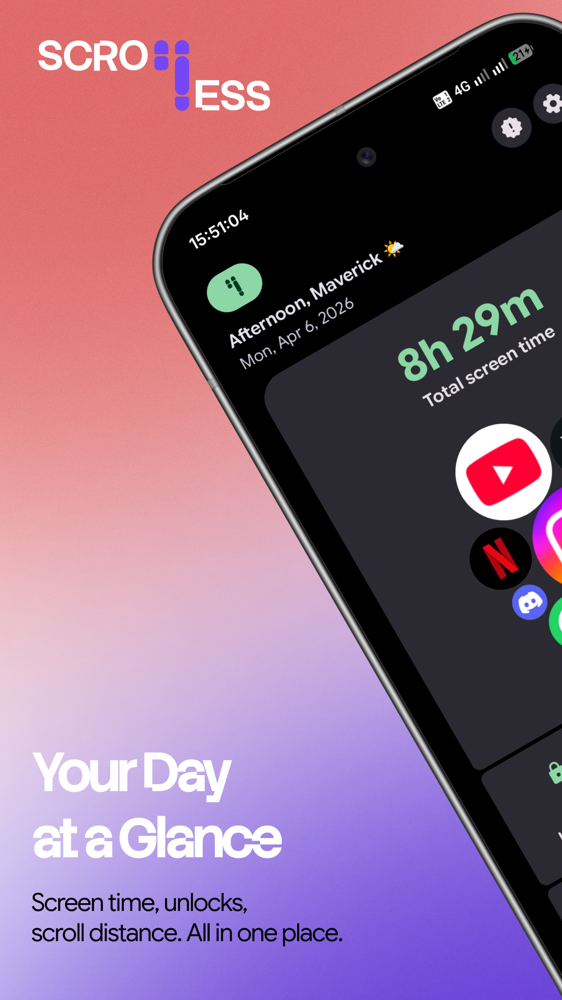
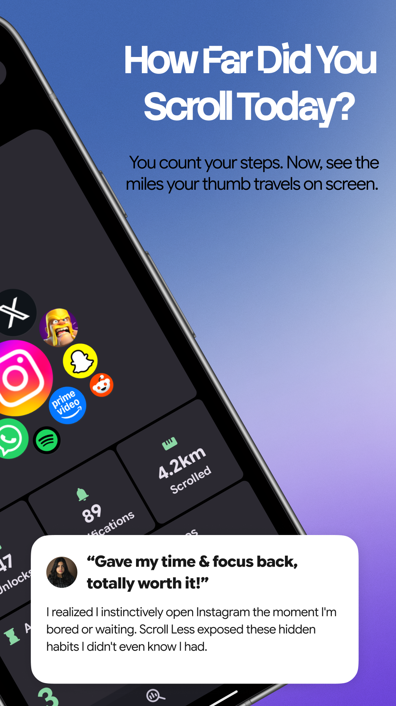
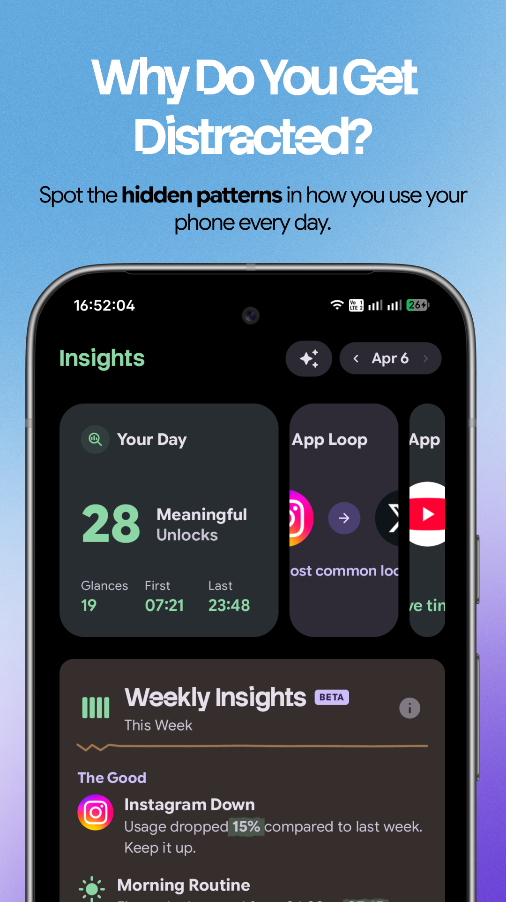
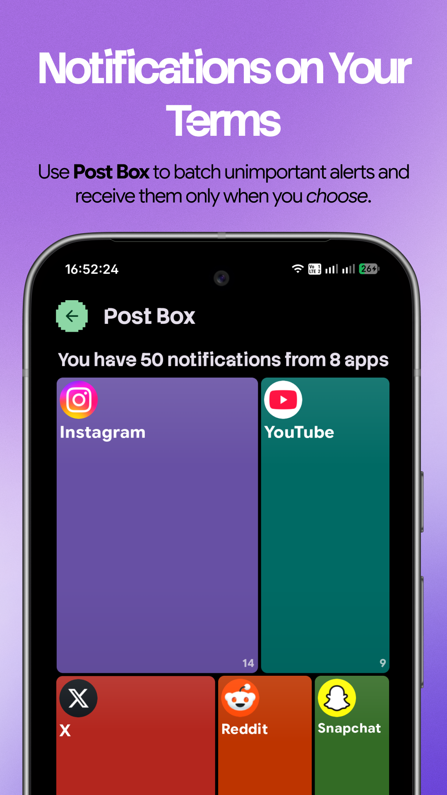
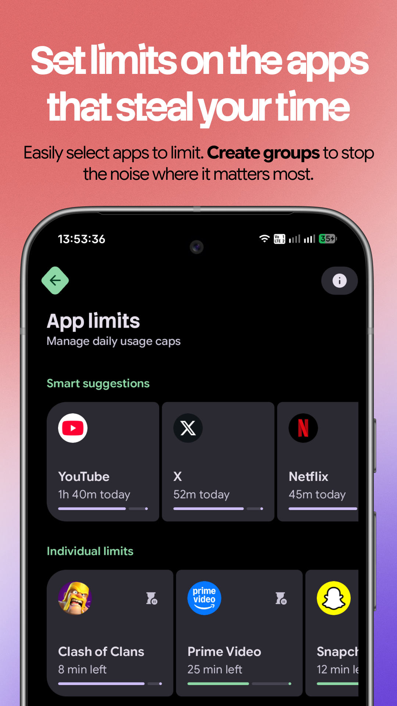

  

<h1 align="center">Scroll Less. Live More!</h1>

  <strong>Your feed never ends. But your day does.</strong> Scroll Less shows you your screen time,
  your real scroll distance, and the patterns behind your habits, all in a private, on-device,
  <strong>Material 3 Expressive</strong> experience.

  &nbsp;
  &nbsp;
  &nbsp;
  

  

<em>Community space for Scroll Less. The app is closed source; no app code lives here.</em>

## Screenshots

  <table border="0" cellspacing="2" cellpadding="0">
    <tr>
      <td width="33%"></td>
      <td width="33%"></td>
      <td width="33%"></td>
    </tr>
    <tr>
      <td width="33%"></td>
      <td width="33%"></td>
      <td width="33%"></td>
    </tr>
  </table>

## This repository

This is the community home for Scroll Less. It is where you help shape the app.

- **Request a feature or vote on one:** [Ideas discussions](https://github.com/InertExpert2911/ScrollLess-Community/discussions/categories/ideas)
- **Report a bug:** [open an issue](https://github.com/InertExpert2911/ScrollLess-Community/issues/new/choose)
- **Ask a question or say hello:** [Discussions](https://github.com/InertExpert2911/ScrollLess-Community/discussions)

The Scroll Less app is proprietary. Its source code is not in this repository.

## Features

### Your scroll distance, in meters

Every swipe adds up. Scroll Less converts those pixels into real-world distance so you can feel the scale.

- Daily scroll distance in meters and kilometers
- Per-app scroll breakdowns, so you know where it all goes
- Calibrate with a credit card for real-world accuracy

### Your habits, made visible

Scroll Less watches how you use your phone and turns it into patterns you can actually understand.

- Accurate screen time and per-app usage, built from the system's own event stream
- Morning routines, late night patterns, and everything in between
- Daily goals and weekly insights into your behavior

### Gentle boundaries that stick

Set daily caps on any app, or on a whole group of apps that share one allowance.

- Detects doomscrolling, late night sessions, and app hopping
- Bundle apps like "Social Media" under a single shared limit
- A calm full-screen blocking screen when a limit is reached
- Snooze when you need to, but each snooze gets shorter

### And more

- **Post Box:** batches distracting notifications into calm, scheduled digests so a buzz does not start a scroll
- **Daily journeys:** a clean timeline of your day's app activity
- **Badges and streaks:** positive reinforcement designed to serve your goals
- **Expressive theming:** 12 seed color themes, dynamic color on Android 12 and up, and a true-black OLED mode
- **Backup and restore:** export and re-import your data and history

## Design

Built end to end on Material 3 Expressive, with physics-based motion, expressive shapes, and a
seed-based color engine. The visual language follows a documented design system covering color,
typography, spacing, motion, and accessibility, with a friendly and supportive tone throughout.
Your data never leaves your device.

## Permissions

Scroll Less explains every permission in-app and asks only for what its features need:

- **Usage access:** lets Scroll Less see which apps you use and for how long, so your dashboard stays accurate.
- **Accessibility service:** lets Scroll Less measure how far you scroll and keep your limits running smoothly.
- **Display over other apps:** shows a gentle on-screen nudge, or the blocking screen, when you have been scrolling a while. Without it, notifications are used instead.
- **Notification access (optional):** counts your notifications and shows you where the noise comes from. Their content is never read.
- **Battery optimization exemption (optional):** keeps Scroll Less running reliably in the background.

## Install

Requirements: Android 9 (API 28) or higher.

## Links

- Website: [scrollless.in](https://scrollless.in)
- Google Play: [in.scrollless.android](https://play.google.com/store/apps/details?id=in.scrollless.android)
- Privacy Policy: [scrollless.in/privacy-policy](https://scrollless.in/privacy-policy/)
- Terms of Service: [scrollless.in/terms-of-service](https://scrollless.in/terms-of-service/)

<em>Scroll less. Live more.</em>

